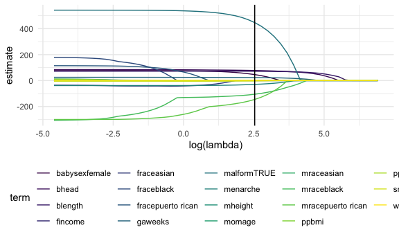
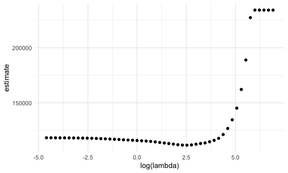

Statistical Learning
================
Saryu Patel
12/3/2021

## Lasso

Predicting birthweight

``` r
bwt_df <- 
  read_csv("data/birthweight.csv") %>% 
  mutate(
    babysex = as.factor(babysex),
    babysex = fct_recode(babysex, "male" = "1", "female" = "2"),
    frace = as.factor(frace),
    frace = fct_recode(frace, "white" = "1", "black" = "2", "asian" = "3", 
                       "puerto rican" = "4", "other" = "8"),
    malform = as.logical(malform),
    mrace = as.factor(mrace),
    mrace = fct_recode(mrace, "white" = "1", "black" = "2", "asian" = "3", 
                       "puerto rican" = "4")
  ) %>% 
  sample_n(200)
```

    ## Rows: 4342 Columns: 20

    ## ── Column specification ────────────────────────────────────────────────────────
    ## Delimiter: ","
    ## dbl (20): babysex, bhead, blength, bwt, delwt, fincome, frace, gaweeks, malf...

    ## 
    ## ℹ Use `spec()` to retrieve the full column specification for this data.
    ## ℹ Specify the column types or set `show_col_types = FALSE` to quiet this message.

``` r
x <- model.matrix(bwt ~ ., bwt_df)[,-1]
y <- bwt_df$bwt
```

Fit lasso.

``` r
lambda_grid <- 10 ^ seq(3, -2, -0.1)

lasso_fit <- glmnet(x, y, lambda = lambda_grid)

lasso_cv <- cv.glmnet(x, y, lambda = lambda_grid)

lambda_opt <- lasso_cv$lambda.min
```

Visualize what we did.

``` r
lasso_fit %>% 
  broom::tidy() %>% 
  complete(term, lambda, fill = list(estimate = 0)) %>% 
  filter(term != "(Intercept)") %>% 
  ggplot(aes(x = log(lambda), y = estimate, group = term, color = term)) +
  geom_path() +
  geom_vline(xintercept = log(lambda_opt))
```



Plot CV curve.

``` r
lasso_cv %>% 
  broom::tidy() %>% 
  ggplot(aes(x = log(lambda), y = estimate)) + 
  geom_point()  
```



Optimal model:

``` r
lasso_fit_opt <- 
  glmnet(x, y, lambda = lambda_opt)

lasso_fit_opt %>% broom::tidy()
```

    ## # A tibble: 12 × 5
    ##    term               step  estimate lambda dev.ratio
    ##    <chr>             <dbl>     <dbl>  <dbl>     <dbl>
    ##  1 (Intercept)           1 -3659.      12.6     0.627
    ##  2 babysexfemale         1    46.2     12.6     0.627
    ##  3 bhead                 1    77.9     12.6     0.627
    ##  4 blength               1    71.8     12.6     0.627
    ##  5 fincome               1     0.252   12.6     0.627
    ##  6 gaweeks               1    23.1     12.6     0.627
    ##  7 malformTRUE           1   447.      12.6     0.627
    ##  8 menarche              1   -29.4     12.6     0.627
    ##  9 mraceblack            1  -105.      12.6     0.627
    ## 10 mracepuerto rican     1  -145.      12.6     0.627
    ## 11 smoken                1    -2.62    12.6     0.627
    ## 12 wtgain                1     2.32    12.6     0.627
